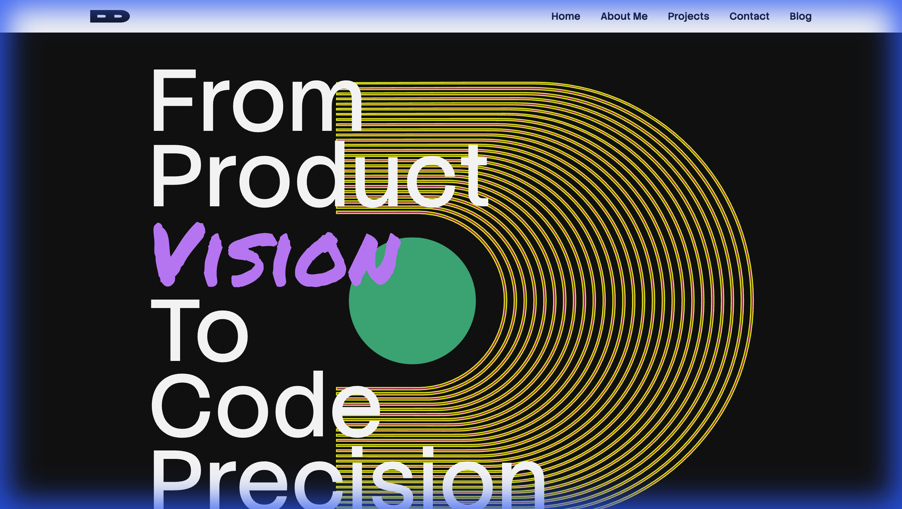
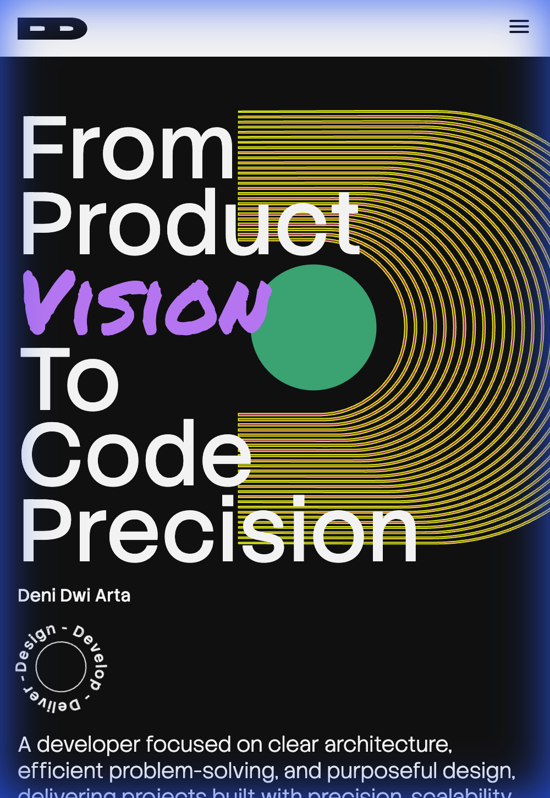

# Software Developer Portfolio - Module 2 Assignment

> **RevoU Full Stack Software Engineering - Milestone 1**  
> **Student:** Deni Dwi Arta  
> **Batch:** Oct 25



## 🚀 Live Demo

**[View the Deployed Website](https://revou-fsse-oct25.github.io/milestone-1-denidarta/)**

---

## 📖 Project Overview

This project is a personal portfolio website designed and built as part of the **Milestone 1** assignment for the RevoU Software Engineering program.

The primary objective was to create a responsive, single-page personal website that effectively showcases a software developer's profile, skills, and work history. The design philosophy emphasizes a modern, dark-themed aesthetic ("Cyber-Professional") that balances creativity with readability.

### Key Objectives

- **Showcase Professional Identity:** clear introduction, detailed bio, and work history.
- **Demonstrate Technical Skills:** Visual representation of the tech stack and core disciplines.
- **Responsive Design:** A seamless experience across mobile, tablet, and desktop devices.
- **Clean Code Architecture:** Utilization of semantic HTML and modular CSS with variables.

---

## 📸 Project Screenshots

### Desktop View

The desktop layout makes use of the full screen width to present content in a grid-based and expansive manner.


### Mobile View

The mobile layout prioritizes vertical scrolling and readability, with a collapsible navigation menu for better UX.



---

## ✨ Features

1. **Dynamic Hero Section**:
    - Features a bold typographic introduction.
    - Includes a rotating "stamp" animation for visual interest.
    - Responsive layout that adjusts from a stacked view on mobile to a side-by-side layout on desktop.

2. **About Me**:
    - A comprehensive bio section with a portrait and professional philosophy.
    - Includes a "Know Deeper" link to a detailed profile page.

3. **Work History Timeline**:
    - A clean, vertical list of professional experiences.
    - Clearly displays role, company, and tenure.

4. **Core Disciplines**:
    - Highlights three main pillars: **Design System**, **Software Engineering**, and **Interface Design**.
    - Uses a card-based layout with custom SVG icons and distinct color accents (Purple, Teal, Yellow).

5. **Tech Stack Grid**:
    - A responsive grid displaying tools and technologies (React, TypeScript, Node.js, Figma, etc.).
    - Grid layout shifts from 2 columns on mobile to 5 columns on desktop.

6. **Selected Works Gallery**:
    - Interactive project cards that expand on hover (Desktop) or click (Mobile).
    - Displays project thumbnails, titles, and years.

7. **Contact Form**:
    - A fully styled contact form with validation states.
    - Includes fields for Name, Email, and Message.

8. **Responsive Navigation**:
    - **Desktop:** Full horizontal menu.
    - **Mobile:** Hamburger menu with a dropdown drawer.

---

## 🛠 Technical Approach

### 1. Mobile-First Design

The development followed a **Mobile-First** methodology. Base styles in `css/index.css` are optimized for small screens, ensuring performance and usability on mobile devices. Media queries (`@media screen and (min-width: 768px)`) are used to progressively enhance the layout for tablet and desktop screens.

### 2. CSS Variables (Design Tokens)

To ensure consistency and maintainability, design tokens are defined in `css/variables.css`. This allows for easy theming and global updates.

```css
:root {
  --page-background: #101010;
  --text-primary: #ffffff;
  --tint-purple: #cd82fe;
  --display-type: 'Permanent Marker', cursive;
  /* ... */
}
```

### 3. Semantic HTML5

The project uses semantic tags (`<nav>`, `<main>`, `<section>`, `<article>`, `<footer>`, `<figure>`) to improve accessibility and SEO.

### 4. BEM-inspired Naming

CSS classes follow a structured naming convention (e.g., `.nav-container`, `.hero-title`, `.card-body`) to prevent style leakage and improve code readability.

---

## 🎨 Styleguide

### Color Palette

The site uses a high-contrast dark theme with vibrant accent colors to highlight key elements.

- **Background:** `#101010` (Deep Black)
- **Text Primary:** `#FFFFFF` (White)
- **Text Secondary:** `#A0A0A0` (Grey)
- **Accents:**
  - 🟣 Purple: `#CD82FE` (Primary Accent)
  - 🟢 Teal: `#02B784` (Secondary Accent)
  - 🟡 Yellow: `#CAD319` (Highlight)

### Typography

- **Headings:** `Permanent Marker` - Adds a handwritten, creative feel.
- **Body:** `Stack Sans Text` - Clean, geometric sans-serif for readability.

---

## 📂 Folder Structure

```text
milestone-1-denidarta/
├── assets/
│   ├── decorative/      # SVGs and decorative elements
│   ├── icons/           # Tech stack and UI icons
│   ├── images/          # Project thumbnails and portraits
│   └── screenshots/     # Project screenshots for README
├── css/
│   ├── index.css        # Main stylesheet (Mobile + Desktop queries)
│   ├── reset.css        # CSS Reset
│   └── variables.css    # CSS Variables / Design Tokens
├── js/
│   ├── navbar.js        # Mobile menu toggle logic
│   ├── project-cards.js # Project card interaction logic
│   └── footer-deco.js   # Footer decoration logic
├── pages/               # Additional pages (Blog, detailed About)
├── index.html           # Main entry point
└── README.md            # Project documentation
```

---

## 💻 Installation & Usage

To run this project locally:

1. **Clone the repository:**

    ```bash
    git clone https://github.com/Revou-FSSE-Oct25/milestone-1-denidarta.git
    ```

2. **Navigate to the project directory:**

    ```bash
    cd milestone-1-denidarta
    ```

3. **Open `index.html`** in your preferred browser.
    - Or use a live server extension (like VS Code Live Server) for the best experience.

---

## 🔮 Future Improvements

- [ ] **Backend Integration:** Connect the contact form to a real email service (e.g., Formspree or EmailJS).
- [ ] **Blog CMS:** Convert the static blog page to fetch content from a Headless CMS.
- [ ] **Dark/Light Mode:** Add a toggle for light mode theme.
- [ ] **Page Transitions:** Implement smooth page transitions using the View Transitions API.

---

## 👏 Acknowledgments

- **RevoU Faculty & Mentors** for guidance.
- **Google Fonts** for the typography.
- **Unsplash** for placeholder project images.
- **Phosphor Icons / Custom SVGs** for iconography.

---

© 2025 Deni Dwi Arta. All Rights Reserved.
